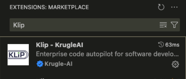
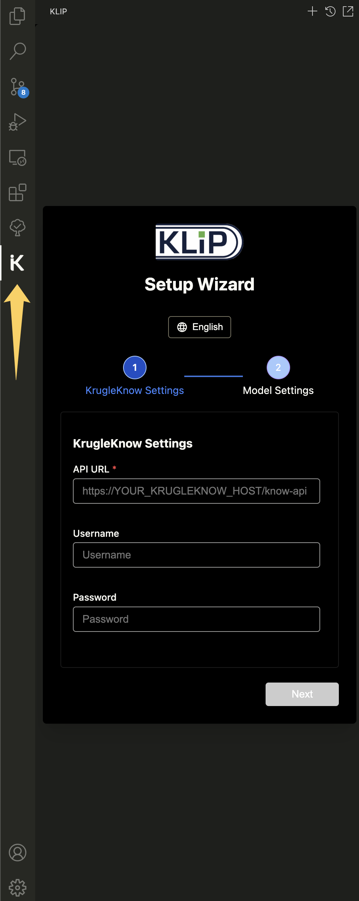
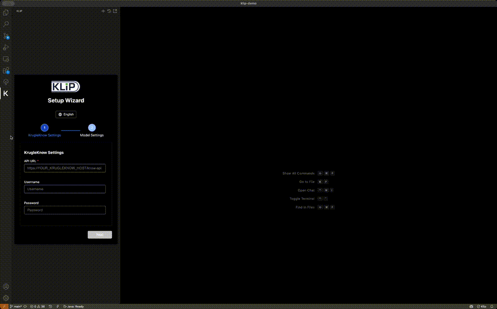
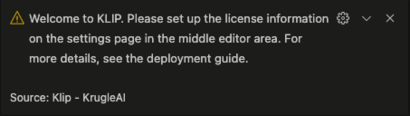
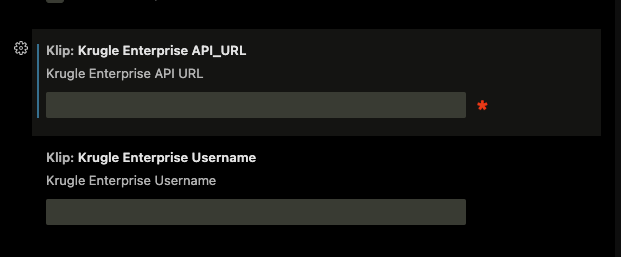
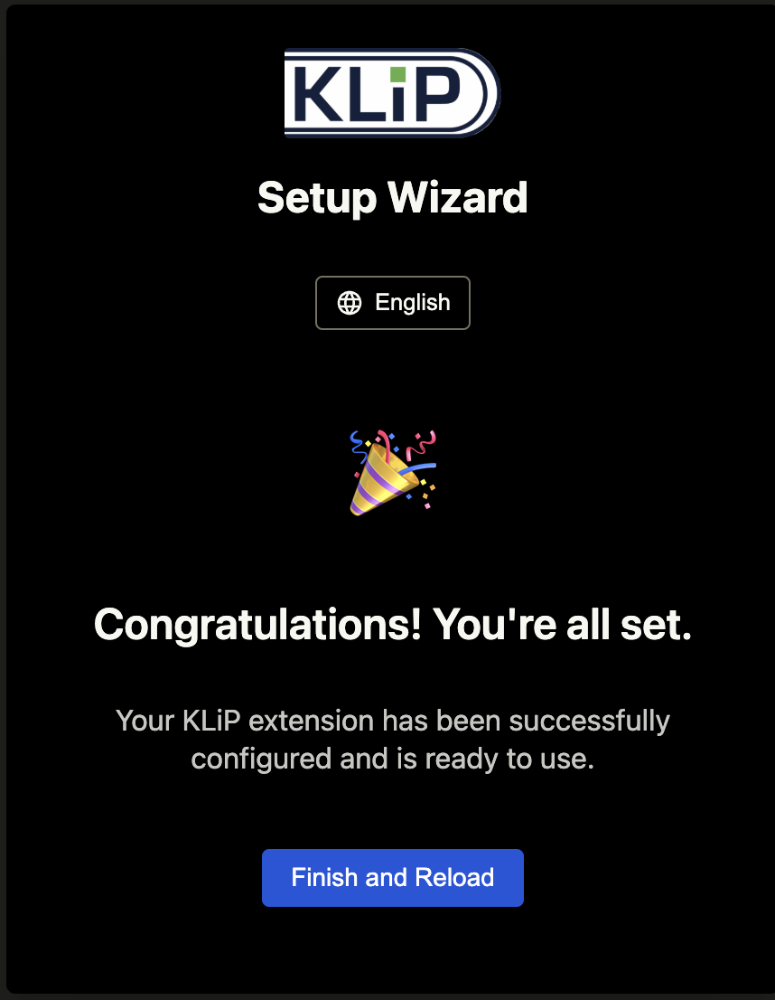

# KrugleAI KLiP デプロイメントガイド

**バージョン**: v0.6.6-beta

- [KrugleAI KLiP デプロイメントガイド](#krugleai-klip-デプロイメントガイド)
  - [前提条件](#前提条件)
    - [最小ハードウェア仕様](#最小ハードウェア仕様)
    - [対応オペレーティングシステム](#対応オペレーティングシステム)
    - [ネットワーク要件](#ネットワーク要件)
  - [インストール](#インストール)
    - [KrugleAI Shastaサービス](#krugleai-shastaサービス)
    - [KrugleAI Base Proサービス（オプション）](#krugleai-base-proサービスオプション)
      - [GPUを搭載したLinuxサーバーにデプロイ](#gpuを搭載したlinuxサーバーにデプロイ)
    - [KLiP for VSCode](#klip-for-vscode)
    - [新しいバージョンへのアップグレード](#新しいバージョンへのアップグレード)

## 前提条件

### 最小ハードウェア仕様

- CPU: 8 コア
- RAM: 16 GB
- SSD/HDD: 最低 10 GB の空き容量

### 対応オペレーティングシステム

- macOS Apple Silicon
- Windows x64
- Linux x64

### ネットワーク要件

- インストールには公共ネットワークへの接続が必要です。インストール後、KLiPは公共ネットワークへのアクセスを必要としません。
- 開発用コンピュータは、KLiPの高度な機能およびライセンス登録のためにKrugleKnow (Krugle Enterprise Search)サーバーにアクセスできる必要があります。

## インストール

### KrugleAI Shastaサービス

[こちら](../Shasta/deployment_guide_ja.md)のガイドに従って、KrugleAI Shastaサービスをデプロイします。

### KrugleAI Base Proサービス（オプション）

> 重要: 従来のKrugleAI Base Basicは廃止され、メンテナンスされていません。代わりにKrugleAI Shastaサービスを使用してください。
>
#### GPUを搭載したLinuxサーバーにデプロイ

GPUアクセラレーションを使用したLinuxサーバーへのデプロイは、推論速度の大幅な向上とパフォーマンスの向上を提供します。[Krugle AI Baseサーバーデプロイメントガイド](https://github.com/krugle2/Krugle-AI/wiki/KrugleAI-Base-Server-Deployment-Guide)に従ってください。

### KLiP for VSCode

1. VSCode拡張マーケットプレイスで「klip」を検索してインストールします。

[Visual Studio Marketplace](https://marketplace.visualstudio.com/items?itemName=Krugle-AI.klip)のKLiP拡張機能で「インストール」をクリックします。

インストール後、左のサイドバーにKLiPのロゴが表示されます。クリックするとKLiP拡張機能が開きます。

KLiPをVS Codeの右側のサイドバーに移動することを強くお勧めします。これにより、KLiPを使用している間もファイルエクスプローラーがアクセス可能になり、サイドバーはキーボードショートカット（cmd/ctrl + option/alt + B）で簡単に切り替えられます。

2. KLiPをインストールして初めて開くと、セットアップウィザードが表示されます。

ステップ1：KrugleKnowを設定します。KrugleKnow APIのURLを入力してください。KrugleKnowサーバーで認証が有効になっている場合は、ユーザー名とパスワードを入力してください。認証が有効になっていない場合は、これらのフィールドを空白のままにしておいてください。

ステップ2（任意ですが、初めてKLiPをご利用になる方や0.7.0より前のバージョンをご使用の方には推奨します）：Shasta/Shasta Proの設定を構成します

VSCode はセットアップウィザードが完了すると再起動します。

次は？[👉🏻 クイックスタート](./user_guide_ja.md#quickstart)の章に従ってLLMを設定してください。

---

### 新しいバージョンへのアップグレード

 > ❗️ アップグレードの前に ~/.klip/config.yaml をバックアップしてください。

1. 拡張機能から `@installed klip` を検索して、KLiPをアンインストールします。

2. VSCode拡張機能マーケットプレイスで「KLiP」を見つけて再インストールします。

3. 変更を有効にするためにVSCodeを再起動します。

[👉🏻 詳細を読む](./user_guide_ja.md#quickstart)

---

ライセンス

[© 2025 Krugle/Aragon Consulting Group, Inc.](https://krugle.co.jp)
