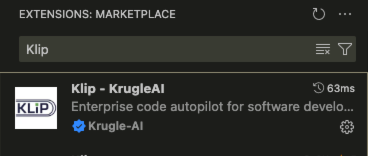
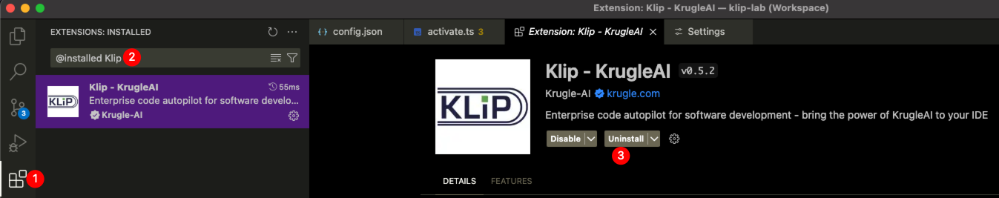

# KrugleAI KLiP 部署手册

**Version**: v0.7.1-beta

- [KrugleAI KLiP 部署手册](#krugleai-klip-部署手册)
  - [前提条件](#前提条件)
    - [最低硬件规格](#最低硬件规格)
    - [支持的操作系统](#支持的操作系统)
    - [网络要求](#网络要求)
  - [安装](#安装)
    - [KrugleAI Shasta服务](#krugleai-shasta服务)
    - [KrugleAI Base Pro服务（可选）](#krugleai-base-pro服务可选)
      - [在带GPU的Linux服务器上部署](#在带gpu的linux服务器上部署)
    - [VSCode版KLiP](#vscode版klip)
  - [升级到新版本](#升级到新版本)

## 前提条件

### 最低硬件规格

- CPU：8核
- 内存：16 GB
- SSD/HDD：至少10 GB的可用空间

### 支持的操作系统

- macOS Apple Silicon
- Windows x64
- Linux x64

### 网络要求

- 安装过程需要公共网络连接。安装完成后，KLiP不再需要公共网络访问。
- 您的开发计算机应当能够访问KrugleKnow（Krugle企业搜索）服务器以使用高级功能和许可证注册。

## 安装

### KrugleAI Shasta服务

按照[此处](../Shasta/deployment_guide_zh.md)的指南部署KrugleAI Shasta服务。

### KrugleAI Base Pro服务（可选）

> 重要：传统的KrugleAI Base Pro已被弃用且不再维护，请改用KrugleAI Shasta服务。
>
#### 在带GPU的Linux服务器上部署

在带GPU加速的Linux服务器上部署可以提供显著更快的推理速度和增强的性能。请按照[Krugle AI Base Pro服务器部署指南](https://github.com/krugle2/Krugle-AI/wiki/KrugleAI-Base-Server-Deployment-Guide)进行操作。

### VSCode版KLiP

1. 在VSCode扩展市场中搜索并安装"klip"。

点击[Visual Studio Marketplace中的KLiP扩展](https://marketplace.visualstudio.com/items?itemName=Krugle-AI.klip)上的`安装`按钮

安装完成后，您会注意到左侧边栏出现了KLiP图标。点击它将打开KLiP扩展。

我们强烈建议将KLiP移动到VS Code的右侧边栏。这样可以确保在使用KLiP时文件资源管理器保持可访问状态，而且可以通过键盘快捷键(cmd/ctrl + option/alt + B)轻松切换侧边栏。

2. 首次安装并打开KLiP时，您将看到设置向导。

第 1 步：配置KrugleKnow。输入KrugleKnow API URL。如果您的KrugleKnow服务器启用了身份验证，请提供用户名和密码。否则，请将这些字段留空。

第 2 步：配置 Shasta/Shasta Pro 设置。如果你已经升级到 0.7.0 及以上版本并完成了模型配置，这一步就不会出现。

设置向导完成后，VSCode将重新启动。

接下来？按照[👉🏻 快速入门](./user_guide.md#quickstart)章节配置您的LLM模型。

---

## 升级到新版本

 > ❗️ 升级前请备份您的~/.klip/config.yaml文件。

1. 通过搜索`@installed klip`从扩展中卸载KLiP。

2. 在VSCode扩展市场中找到并重新安装"KLiP"。

3. 重启VSCode使更改生效。

[👉🏻 了解更多](./user_guide.md#quickstart)

---

版权信息

[© 2025 Krugle/Aragon Consulting Group, Inc.](https://krugle.co.jp)
