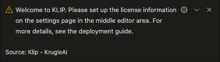
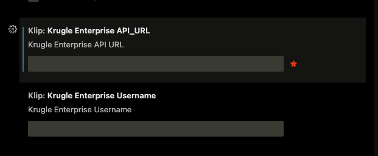
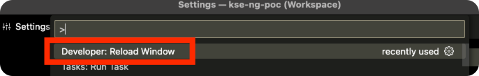

# KrugleAI KLiP Deployment Guide

**Version**: v0.6.6-beta

- [KrugleAI KLiP Deployment Guide](#krugleai-klip-deployment-guide)
  - [Prerequisites](#prerequisites)
    - [Minimum Hardware Specifications](#minimum-hardware-specifications)
    - [Supported Operating Systems](#supported-operating-systems)
    - [Network Requirements](#network-requirements)
  - [Installation](#installation)
    - [KrugleAI Shasta service](#krugleai-shasta-service)
    - [KrugleAI Base Pro service (Optional)](#krugleai-base-pro-service-optional)
      - [Deploy on a Linux server with GPU](#deploy-on-a-linux-server-with-gpu)
    - [KLiP for VSCode](#klip-for-vscode)
  - [Upgrading to a new version](#upgrading-to-a-new-version)

## Prerequisites

### Minimum Hardware Specifications

- CPU: 8 cores
- RAM: 16 GB
- SSD/HDD: at least 10 GB of free space

### Supported Operating Systems

- macOS Apple Silicon
- macOS Intel
- Windows x64
- Linux x64

### Network Requirements

- The installation requires public network connectivity. After installation, KLiP does not require public network access anymore.
- Your developer computer should have access to the Krugle Enterprise server for advanced features and license registry.

## Installation

### KrugleAI Shasta service

Deploy the KrugleAI Shasta service by following the guide [here](../Shasta/deployment_guide.md).

### KrugleAI Base Pro service (Optional)

> IMPORTANT: The legacy KrugleAI Base Basic is deprecated and no longer maintain, use KrugleAI Shasta service instead.
>
#### Deploy on a Linux server with GPU

Deploying on a Linux server with GPU acceleration offers significantly faster inference speeds and enhanced performance. Follow the  [Krugle AI Base Server Deployment Guide](https://github.com/krugle2/Krugle-AI/wiki/KrugleAI-Base-Server-Deployment-Guide).

### KLiP for VSCode

1. Search for and install "klip" from the VSCode extension marketplace.

Click the `Install` on the [KLiP extension in the Visual Studio Marketplace](https://marketplace.visualstudio.com/items?itemName=Krugle-AI.klip)

Upon installation, you'll notice the KLiP logo appearing in the left sidebar. Clicking on it will open the KLiP extension.

We highly suggest relocating KLiP to the right sidebar of VS Code. This ensures the file explorer remains accessible while using KLiP, and the sidebar can be easily toggled with a keyboard shortcut (cmd/ctrl + option/alt + B).

2. When you first install and open KLiP, you will see a warning message in the bottom right corner. This means you need to set up your KrugleAI license.

The KLiP settings will open automatically, as shown below, enter the Krugle Enterprise API URL. If authentication is enabled on your Krugle Enterprise server, enter the username. Otherwise, leave the username field blank.

1. Reboot the entire VSCode. Alternatively, reload the window by typing the shortcut `CMD + SHIFT + P` on macOS or `CTRL + SHIFT + P` on other platforms. Then choose the `Reload Window` option.

If authentication is enabled on your Krugle Enterprise server, you will see an error message and ask your "Enter Password". Follow [this guide](./user_guide.md#why-klip-is-not-activated) to resolve this issue.

Next? Configure your LLMs by following the [👉🏻 QuickStart](./user_guide.md#quickstart) chapter.

---

## Upgrading to a new version

1. Uninstall KLiP from Extensions by searching `@installed klip`.

2. Locate and reinstall "KLiP" from the VSCode extension marketplace.

3. Restart VSCode for the changes to take effect.

4. Run the "KLiP Setup Wizard" from "Help Center" again.

 > ❗️ Please backup your config.son before running the Setup Wizard.

[👉🏻 Read more](./user_guide.md#quickstart)

---

License

[© 2025 Krugle/Aragon Consulting Group, Inc.](https://krugle.co.jp)
